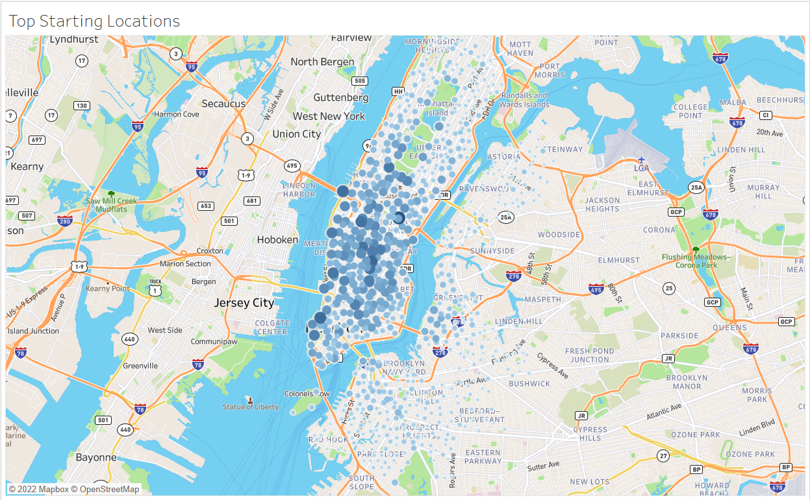
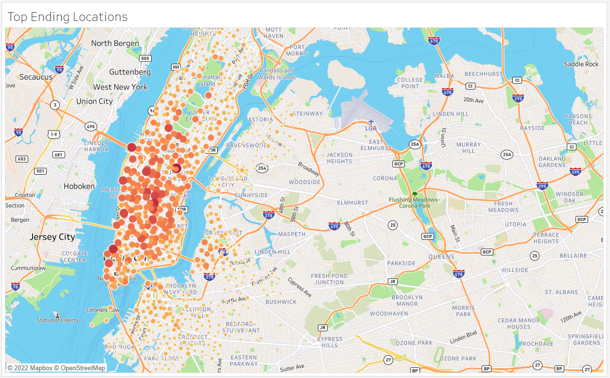
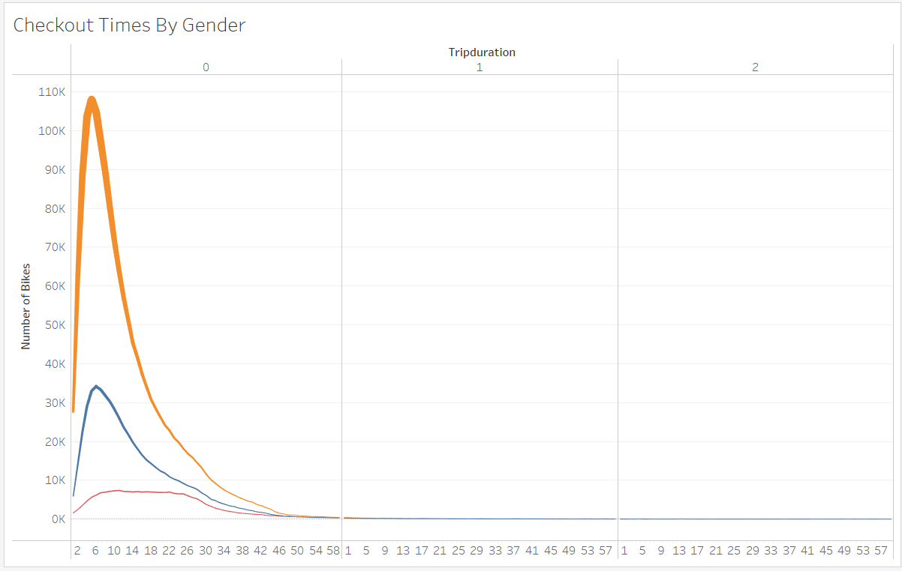
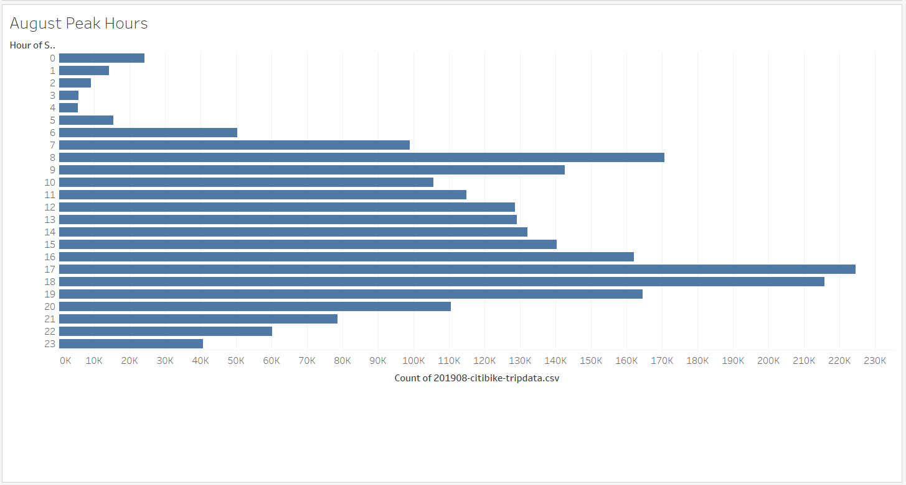
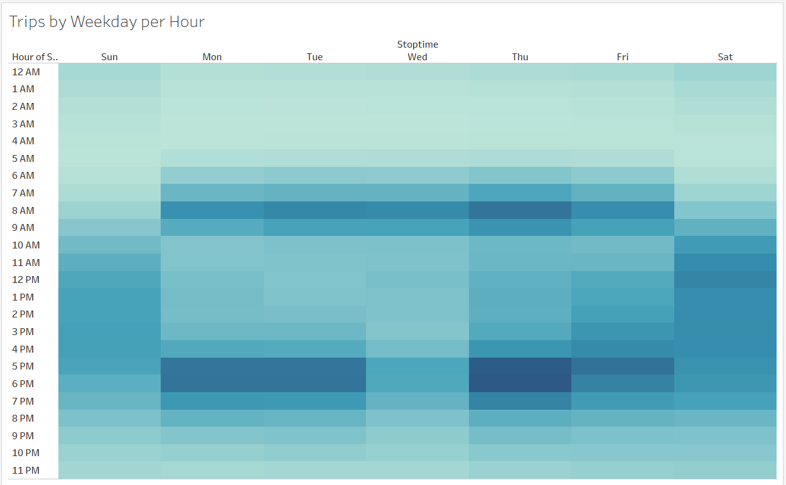
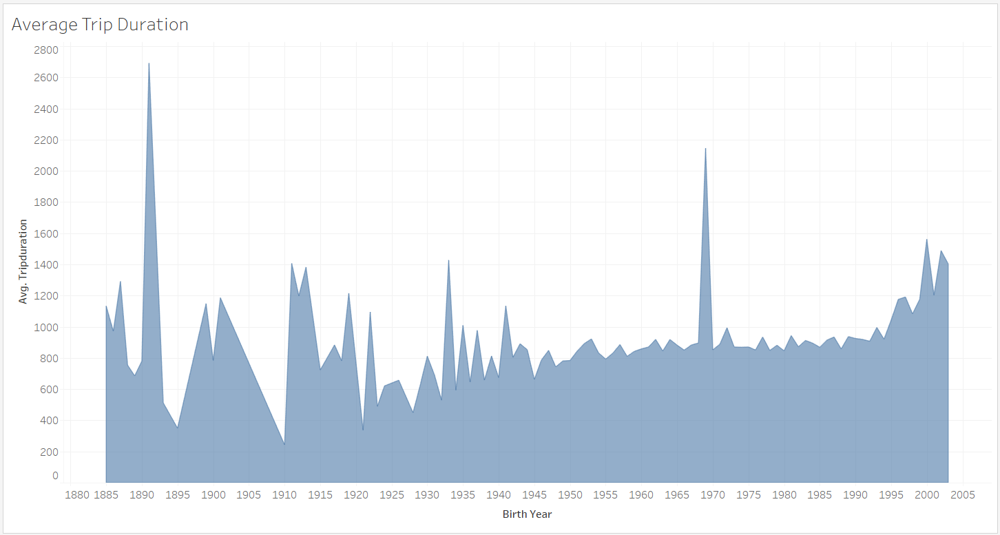

## Overview
The purpose of this challenge is to convert the tripduration column to the datetime data type. I then used the new CSV file to create five new visualizations and put them in a story on Tableau.

## Results

The results of this analysis will help make decisions for planning a Bike Share in Des Moines.

link to story: https://public.tableau.com/app/profile/eric.blankinship/viz/BikeSharingChallenge_16631215506310/ConsumerBikeShareStory?publish=yes

### Top Starting Locations

By adding the map, this image shows that the most popular starting locations tend to be near public transportation. Most likely, all are high foot-traffic areas. We should likely for similar area in Des Moine to maximize our consumer base.

### Top Ending Locations

The top ending locations follow the same trend, which will help with placement of stations.

### Checkout Times by Gender

This graph shows that a majority of users checkout bikes for around five minutes. This shows us that the need for destinations close to pick up are very important. Generally, bus and train stops need to be close to many destinations as well as a mode of tranport after the bike has been turned in. Male usage is the highest among users. There could be ways to close the gap with different advertisements or promotions, but work attire could be the factor here.

### August Peak Hours

The peak hours of August were in between 5PM and 6PM, we can come up with process improvements to have as many bikes as possible ready for transport.

### Trips by Weekday per Hour

This graph supports our theory that our normal busiest days are from 5PM-6PM, however traffic between 9AM-10AM is a bit high as well. 

### Trips by Gender (Weekday per Hour)

.png)

This heatmap shows the most popular times and days are the same for males and females. It matches with other charts that Monday thru Friday at rush hours are the most popular times. 

### Average Trip Duration by BirthYear

The chart shows the average trip duration by birh year for all of our users. The trend shows that our order users have a slightly higher average than the younger ones

## Summary

Overall, males were the primary users of Citibikes in New York City during August 2019. The most usage occurred Monday thru Friday and starting and ending locations of Citibike trips were the same. Additional analysis is needed in order to determine if Citibikes is a great fit for Des Moines, Iowa.
Anpther visualization tp consider that may help investors determine if Citibikes are a good fit for Des Moines would be to look at weather data. If the weather is too harsh most of the year then may need to consider a differentr start up location for this venture
